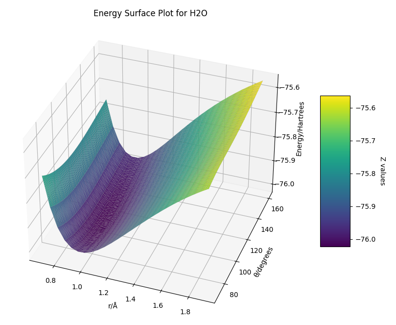
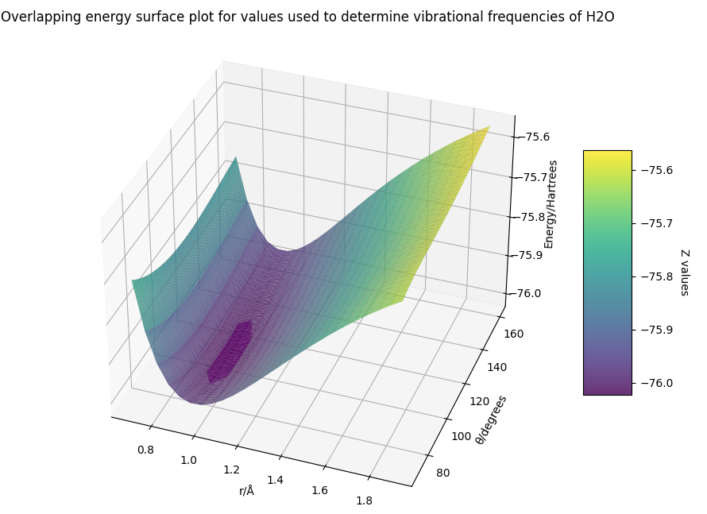

# Triatomic Vibrational Frequency Analyzer

A command-line tool written in Python3 for computing the equilibrium energy, bond length and bond angle,
symmetric stretching frequency, bending mode frequency. This program also plots the energy surface as a function of bond length and bond angle.

## Dependencies

- numpy
- matplotlib
- scipy

## Usage

Running the script as is will trigger an input interactively in which the user can choose H2O or H2S. The threshold is set to a default of 0.015. This value can be changed by using flags.

### Using flags

$ python h2x-analyzer.py -molecule H2O -threshold 0.01

Equilibrium Energy: -76.024 Hartrees
Equilibrium Bond Length: 0.950 Å
Equilibrium Bond Angle: 105.0°
Symmetric Stretch Frequency: 3754 cm⁻¹
Bending Mode Frequency: 1551 cm⁻¹

